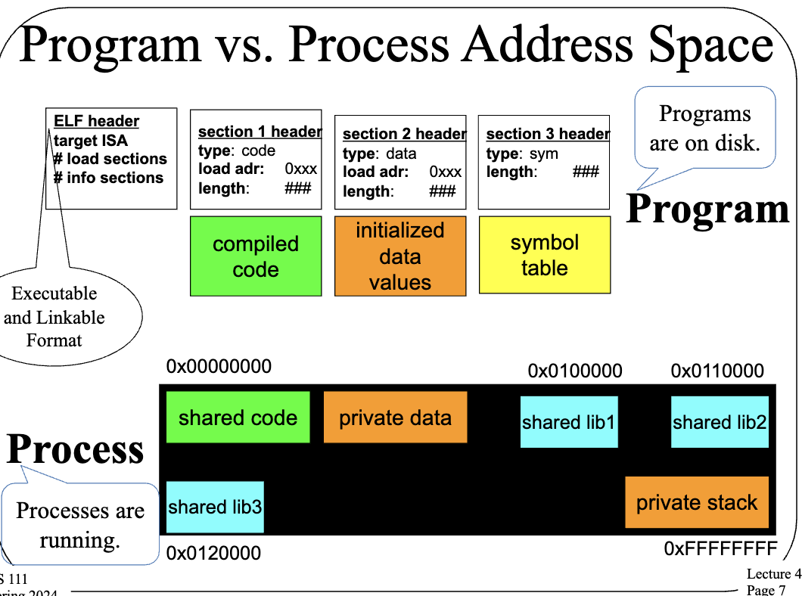

# LECTURE 4: Process, Ezecution, and State

### What is a **Process**?
A process is a type of interpreter (run instructions) that executes an instance of a program (virtual private computer). A process is an *object* that is characterized by Its properties (state)and its operations. Remember that not all OS objects are processes but processes are a central and vital OS object type.

Simple Note: Self-modifying code should be avoided at ALL costs!!!

### WHat is "State"?
All persistent objects have "state"  that distinguished them from other objects and characterizes an object's curent condition. OS objects can have many different states.

Contents of state depends on type of object. Complex operations often mean complex state. These are always representable as a set of bits where we can save/restore the bits of the total state. We can also talk of a state subset

### Examples of OS Object State
- Scheduling priority of a process
- Current pointer into a file
- COmpletion conidtion of an I/0 operation
- LIst of memory pages allocated to a process.
- OS objects' state is mostly managed by the OS itself and not directly by user code. It must ask the OS to access or alter state of OS objects.

### Process Address Spaces
Each process has some memory addresses reserved for its private use. These are called **address space**. A process' address space is made up of all memory locations that the porcess can address. If an address isn't in it address space, the process can't request to access it. Modern OSes pretend that every process' address space can include all of memory (under the covers this isn't true).

### Program vs Process Address Space


### Process Address Space Layout
All required memory elemnts for a process must be put somehwere in its address space. There are different types of memory elements that have different requirements (ex: code is not writable but must be executable | stacks are readable and writable but not executable) Each OS has some strategy for where to put these process memory segements.


### Layout of Linux Processes in Memory
In Linux systems, code segments are statically sized, data segment grows up, stack segement grows down. They are also not allowed to meet


### Address Space: Code Segments
1. We start with a load module.
    - The output of a linkage edito
    - All external references have been resolved
    - All modules combined into a few segments (text, data, BSS, etc)

2. Code must be loaded into memory
    - Instructions can only be run from RAM
    - A code segment must be created
    - Code must be read in from the load module.
    - Map segment into process' address space

3. Code segments are read/execute only and sharable
    - Many process can use the same code segments.

### Address Space: Data Segments
Data must be initialized in address space since process data segment must be created and mapped into the process' address space. The initial contents must be copied from load module. BSS (Black Started by Symbol) must be initialized to all zeroes.

Data segments are read/write and process private. The program can grow or shrink data segments using the ```sbrk``` sys call.

### Processes and Stack Frames
Moder programming languages are stack-based. Each procedure call allocated a new stack frame as it used for:
1. Storage for procedure local (vs. global) variables
2. Storage for invcation parameters
3. Save and restore registers (popped off stack when call returns)

Most modern CPUs also have stack support. Stack must be preserved as part of process state.

### Address Space: Stack Segment
- Size of staack depends on program activities
    - Ex: amount of local storage used by each routine
    - grows larger as calls nest more deeply
    - After calls return, their stack frames can be recycled
- OS manages the process' stack segment
    - Stack segment created at same time as data segment
    – Some OSes allocate fixed sized stack at program load time
    - Some dynamically extend stack as program needs it
- Stack segments are read/write and process private
    – Usually not executable


### Address Space: Libraries
**Static Libraries** are added to load module. Each lod module has its own copy of each library. The program must be re-linked to get new version.

**Shared Libraries** use less space. It has a one in-memory copy that's shared by all processes, it keeps the library seperate from load modules, and OS loads library along with program

Libraries reduce memory use making a program load faster. There are also easier/better library upgrades.

### Other Process State
1. Registers
    - General Registers
    - Program counter, processor status, stack pointer, frame pointer
2. Process' own reosurces
    - Open files, current working directory, looks
3. OS-Related state information
    - Time spend when executing a process

The OS needs some data structure to keep track of all this info.

### Process Descriptors
Basic OS data structure for dealing with processes. This stores all info relevant to the process (ex: state to restre when process is dispatched, references to allocated resources, info to support process operations). This is managed by the OS. It is used for scheduling, secruity decisions, adna allocation issues.

### Linux Process Control Block
The data structe Linux (an other UNIX systems) use this to handle processe (aka PCB).

Example:

Process Descriptor |
---
Process ID |
State |
Pointer | 
Priority | 
Program counter | 
CPU registers | 
I/O information |
Account information | 
etc.


These keeps track of unique process ID, state of the process, address space information, etc.